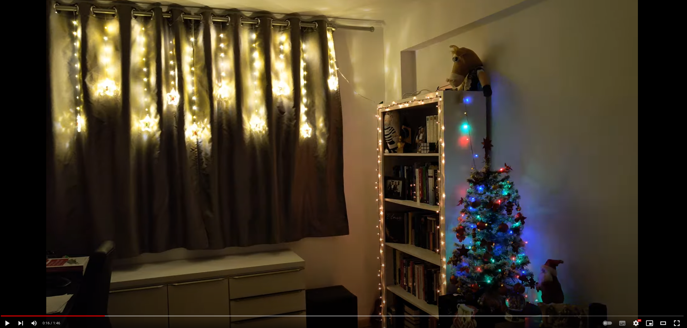
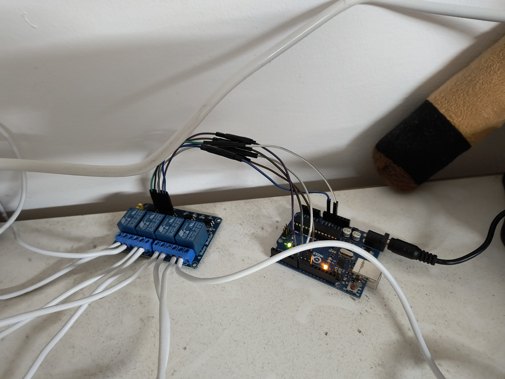
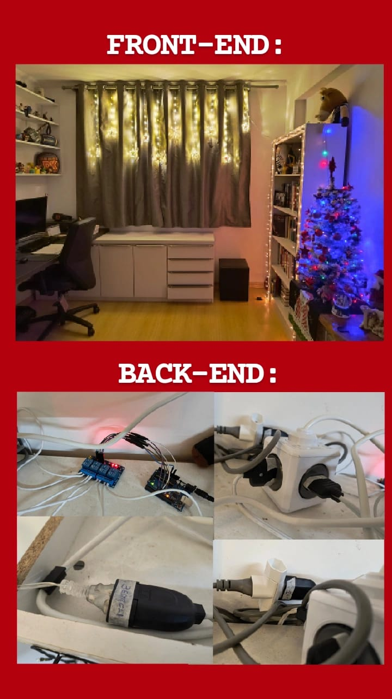

# Christmas Blinking Light System 🎄

System to synchronize Christmas lights with Jingle Bells music using an Arduino UNO.

## Physical Setup ⚡

The physical setup consists of 3 sockets connected to a relay module, which is connected to the Arduino. The Arduino is responsible for controlling each of the relays:

## Meme 😂

Obviously, the classic Front-End/Back-End meme couldn't be left out:

